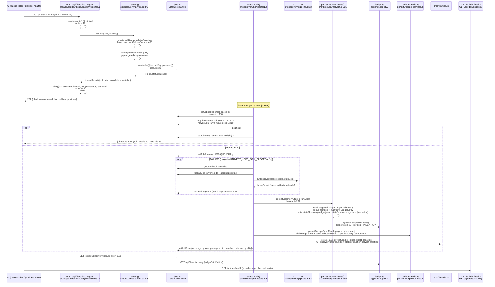
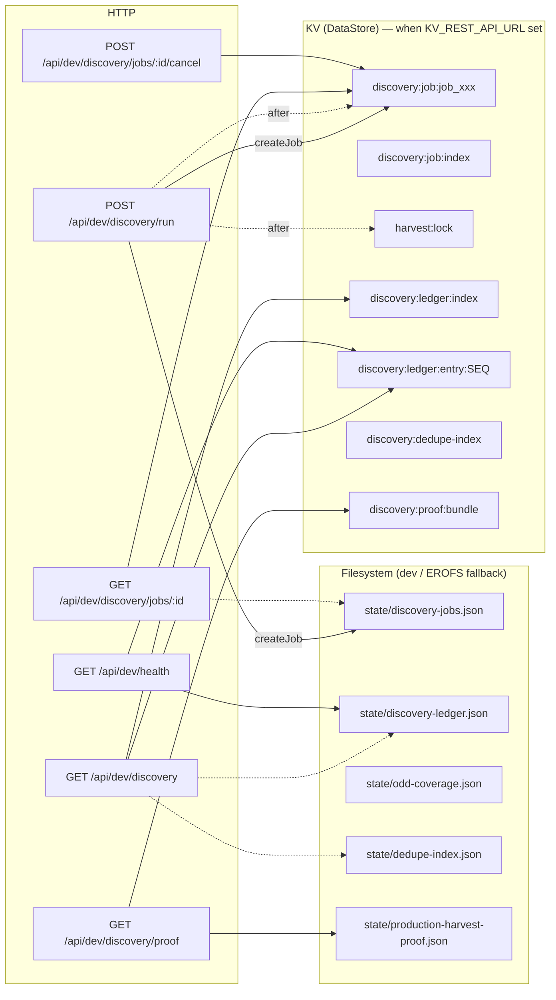

# Harvest Backend Seams — Auto-Monitor Surface (HV1)

**Ticket:** `HV1-backend-architecture` `workflow/wayfinder/maps/harvest-verification/tickets/HV1-backend-architecture.md:1`  
**Date:** 2026-09-08  
**Scope read-only:** no ticket or `state/*.json` edits — this doc is `write-only` per task.

## Question

> What exact seams do **"Run this gap (Live)"** and **"Run Live Harvest"** travel through, and which backend artifacts must an auto-monitor poll to prove success vs degraded vs silently dropped?

Both buttons are two skins over one POST seam. Everything below traces source of truth via direct file reads.

---

## 1. Two entry points, one backend

| Button | Component | POST body | Live flag | CellKey |
|---|---|---|---|---|
| **Run this gap (Live)** | `src/app/dev/mission-control/_components/queue-ticker.tsx:158` → `src/app/dev/mission-control/page.tsx:120` `handleRunGap` | `{ live:true, cellKey }` | `true` | non-null, e.g. `"canada:PRELIMINARY_DESIGN"` |
| **Run Live Harvest** | `src/app/dev/mission-control/_components/provider-health.tsx:258` `handleRun` | `{ live:true }` | `true` | `null` (omitted) |

Both hit `POST /api/dev/discovery/run` (`src/app/api/dev/discovery/run/route.ts:1`). Dry-run siblings (`{live:false}` or absent) bypass provider secrets and inject `fixtureDocsFor` — the monitor only cares about `live:true`.

### UI survivability (not in ticket scope but bounds what the monitor sees)

- ProviderHealth persists `jobId` in `localStorage["auditorai.discovery.jobId"]` (`provider-health.tsx:57`), restores on mount (`provider-health.tsx:184`), polls `GET /api/dev/discovery/jobs/:id` every **1.5 s** (`provider-health.tsx:122`), and also re-polls on `visibilitychange`/`focus` (`provider-health.tsx:210`).
- MissionControl `handleRunGap` keeps its own `gapPollRef` interval at 1.5 s (`page.tsx:135`) and on `done` calls `reload()` which re-fetches coverage/discovery/readiness.
- Either way the HTTP contract is identical — `localStorage` only changes how the UI recovers after refresh; the monitor should poll the backend directly.

---

## 2. Full flow diagram

```
request → job → D01..D10 → ledger / coverage / dedupe → health
```

### 2a. Sequence (what the monitor observes on the wire)



### 2b. Request → filesystem / KV fork



`store.ts:162` `createFallbackStore` wraps every op as KV-first with `MemoryStore` fallback — in dev with no `KV_REST_API_URL`, all KV keys live in-memory or in `state/*.json` files.

---

## 3. Seam-by-seam trace

### 3.1 Route seam `src/app/api/dev/discovery/run/route.ts:1`

```ts
// route.ts:11  export async function POST(req)
const auth = await requireAdmin(req); if (!auth.ok) return auth.res;  // :12
let body = JSON.parse(await req.text())  // :16 forgiving parse → 400 on throw
result = await harvest({live, cellKey})  // :25
  catch UnknownCellKeyError → 400         // :27
after(async () => executeJob(result.jobId, result.ctx, result.providerIds, result.ranAtIso)) // :36
return 202 {jobId, status, ranAtIso, live, cellKey, providers} // :47
```

- `maxDuration = 60` (`route.ts:9`) — lab ceiling, `executeJob` runs via `after()` so the 202 returns immediately.
- `after()` error is swallowed with `console.error` (`route.ts:43`) — a busy lock **never** turns the 202 into a 4xx/5xx; the monitor must poll the job.
- `serverError(e)` redacts unknown errors to `500 {error:"internal server error"}` (`src/lib/api.ts:118`) but maps `StoreUnavailableError → 503` via `ERROR_TABLE` (`api.ts:111`).

### 3.2 `src/discovery/harvest.ts:373` `harvest()` — gap-aware vs gap-targeted

**Types** (`harvest.ts:73`):
```ts
HarvestInput { live?:boolean; cellKey?: string|null }
HarvestResult { jobId, status:"queued", ranAtIso, live, cellKey, providers, ctx, providerIds }
```

**`cellKey=null` (gap-aware) — `Run Live Harvest`:**
```ts
// harvest.ts:17-20  gap-aware branch
covRaw = read(state/odd-coverage.json)  // best-effort
top = gaps_ranked.slice(0,3)            // up to 3 hottest gaps
queryJurs = Set(top.map(k => JUR_MAP[k.split(":")[0]]))   // deduped
queryThemes = top.map(themeFor)          // per-gap theme
```
If the file is missing/unreadable the fallback is `["UK","US","CA","AE","INT"]` with generic themes (`harvest.ts:442`). The current `state/odd-coverage.json:326` has 15 entries in `gaps_ranked` from `usa:DETAILED_DESIGN` downward — a gap-aware run therefore fires 3 themes derived from the top 3, e.g. `final design road safety audit` vs `feasibility concept...` via `themeFor` (`harvest.ts:30`).

**`cellKey="jur:STAGE"` (gap-targeted) — `Run this gap (Live)`:**
```ts
// harvest.ts:33-34  themeFor
if (cellKey includes DETAILED_DESIGN) → "final design road safety audit"
else if FEASIBILITY_CONCEPT → "feasibility concept road safety audit"
else → "preliminary design road safety audit"  // PRELIMINARY_DESIGN etc.

// harvest.ts:412
jur = JUR_MAP[cellKey.split(":")[0].toLowerCase()]  // uk→UK, usa→US, canada→CA, uae→AE
queryJurs = [jur]; queryThemes = [themeFor(cellKey)]
```
Validation before anything else: reads `policies/odd.json` (`harvest.ts:386`), builds set `${jurisdiction_id}:${canonical_stage.sort().join("+")}` and throws `UnknownCellKeyError` if `cellKey` not in it. `policies/odd.json:16` declares 16 cells (5 × `in` + 10 × `mapped_unproven` + 1 × `structurally_absent` excluded).

**Common tail (`harvest.ts:400-466`):**

- Providers: `LIVE ? ["seed-portals", ...listProviderIds().filter(p≠seed-portals && providerEnabled(p) && !DEPRECATED)] : ["seed-portals"]` (`harvest.ts:400`). `google-cse` is deprecated set (`harvest.ts:18`) — filtered even when enabled. `providerEnabled` (`src/discovery/providers/provider-types.ts:45`) is env-or-Keychain `auditorai/*` check per `src/discovery/keychain.ts:35`.
- `ranAtIso`: `LIVE ? nowIso() : 1970-01-01T00:00:00.000Z` (`harvest.ts:407`).
- Dedupe index: sync read from `state/dedupe-index.json` (`harvest.ts:432`), with KV sync fallback via `globalThis.__KV_DEDUPE_INDEX__` in `dedupe-persist.ts:21`.
- `ctx`: `{ ranAtIso, query:{jurisdictions,themes}, providers, dedupeIndex, acquireDocs }` where `acquireDocs` is `undefined` when live (real `%PDF` fetch via `withHostBudget` in `pipeline.ts:142`) and `fixtureDocsFor` when dry (`harvest.ts:449`).
- `createJob({live, cellKey, providers})` → `appendLog D00-QUEUED` then return. Never await `executeJob` here.

### 3.3 `src/discovery/jobs.ts:1` — job store via DataStore KV/file

Seam owns only `discovery:job:*` and `discovery:job:index` (`jobs.ts:41-42`).

| Op | KV path | File fallback | Notes |
|---|---|---|---|
| `createJob` `jobs.ts:133` | `PUT discovery:job:job_<id>` + `PUT discovery:job:index` (unshift, cap 20, prune) | `state/discovery-jobs.json` `{index, jobs}` | `genId()` `jobs.ts:48` → `job_<base36Time>_<rand>` |
| `getJob` `jobs.ts:199` | `GET discovery:job:<id>` | `readJobsFile().jobs[id]` | On store-absent + KV-env-absent, reads file |
| `updateJob` `jobs.ts:278` | read→merge→`PUT` | read→merge→write file | Merges `patch` + sets `updatedAt` |
| `appendLog` `jobs.ts:322` | read job → push entry → trim last 200 → `PUT` | same via file | Sets `currentNode = entry.node` |
| `listJobs` `jobs.ts:223` | paginates `discovery:job:index` then `getMany` | file index | cursor semantics + cap `[1,20]` |
| `setJobRunning` `jobs.ts:361` | `updateJob{status:running}` | same | Also called per-node |
| `setJobDone` `jobs.ts:365` | `updateJob{status:done, result}` | same | Payload: `src/discovery/harvest.ts:269` `ranAtIso, coverage, queue, packages, hits, matched, refusals, quality` |
| `setJobError` `jobs.ts:369` | `updateJob{status:error, error}` | same | Used for lock-busy terminal state |
| `StoreUnavailableError` | `store.ts:9` transport failure (non-OK REST, malformed) | — | Swallowed inside `jobs.ts` per-op `try/catch→return null/[]`; surfaces only via `api.ts:111` in routes |
| No `state/discovery-jobs.json` on disk today | `bash: state/discovery-jobs.json: No such file or directory` | — | Expected when `KV_REST_API_URL` is set or job history trimmed; fallback via `jobsFilePath()` `jobs.ts:64` would create on next write |

All `DataStore` calls branch on `store` param → `isKv()` (singleton `getDataStore().kind==="kv"`) → file.

`cancel` (`src/app/api/dev/discovery/jobs/[id]/cancel/route.ts:6`) is `updateJob{status:cancelled}` — `executeJob` polls `getJob` before acquiring lock (`harvest.ts:118`) and before each node (`harvest.ts:192`) and honours `D00-CANCELLED` log.

### 3.4 `executeJob` `harvest.ts:106` — the worker

**Locking:**

```ts
let HARVEST_LOCK = false; // process-local, harvest.ts:104
let kvRelease = null;
{ acquireHarvestLock(store, 120, jobId) } // harvest.ts:152 -> harvest-lock.ts:10  SET NX EX 120
  if !acquired → setJobError("harvest lock held (kv)") → return  // harvest.ts:156
catch → fallback to process-local only
if HARVEST_LOCK → setJobError("harvest is already running") → return // harvest.ts:140
HARVEST_LOCK = true; ... finally { HARVEST_LOCK=false; kvRelease?() } // harvest.ts:164 + 286
```

KV lock holder-guarded: `release()` does `GET harvest:lock` check `=== holder` then `DEL` (`harvest-lock.ts:28`). TTL 120 s (`HARVEST_LOCK_TTL_SECONDS=120`), global lock ceiling `// ponytail:` comment (`harvest-lock.ts:3`).

Inside the lock:

```
setJobRunning("D01-DISCOVER")
appendLog D00-QUEUED  "providers a,b query jurs=... themes=..."
state = {}; artifacts=[]; refusals=[]
budget = HARVEST_NODE_POLL_BUDGET env else DISCOVERY_NODE_IDS.length (10)  // harvest.ts:181
for each nodeId in DISCOVERY_NODE_IDS.slice(0,budget):
  getJob check cancelled → D00-CANCELLED + return
  updateJob currentNode + appendLog "start <nodeId>"
  runDiscoveryNode(nodeId, state, ctx)            // src/discovery/pipeline.ts:366
  state = {...state,...res.patch}; artifacts.push(...res.artifacts); refusals...
  appendLog "done <nodeId> — patch <keys> artifacts N refusals M <elapsed>ms"
```

`runDiscoveryPipeline` vs single-node: `executeJob` calls per-node to allow progress logging + cancellation. Full pipeline in `pipeline.ts:339` is same order without the logging.

**Post-loop persistence (not skipped, present even when VITEST):**

- `persistDiscoveryState(s, ranAtIso)` guarded by `process.env.VITEST !== "true"` (`harvest.ts:230`), so in prod it always runs.
- Best-effort wrappers: KV mirror and dedupe still attempt even if file writes EROFS.
- `setJobDone` always last except `catch → appendLog ERROR + setJobError`.

### 3.5 `src/discovery/ledger.ts:1` — ledger KV + file mirror

- Keys: `DISCOVERY:LEDGER:INDEX = "discovery:ledger:index"` and `discovery:ledger:entry:<seq>` (`ledger.ts:6-7`).
- `appendLedgerKV(entries)` (`ledger.ts:10`) inside `withPersistenceSingleWriter` (single-writer lock `store.ts: single-writer.ts:7`): loads current index, per-entry `GET entryKey(seq)` NX check (`ledger.ts:19`) to avoid overwrite on duplicate, `PUT` if missing, pushes seq to index, sorts, trims to last 500 (`ledger.ts:31`), `PUT index`.
- `getLedgerTailKV(limit, store)` (`ledger.ts:35`): loads index, slices last `limit`, `getMany(entryKeys)`, prunes orphan nulls from index, sorts by seq.
- `persistDiscoveryState` (`harvest.ts:295`): reads `state/discovery-ledger.json` (file tail), reads KV tail last 50 via `getLedgerTailKV(50)` to compute `lastSeq` max, then for each slice (`harvest.ts:329`) `["discovery_hits","qualified","matched","acquired","classified","package","provenance","quality","coverage","queue"]` with payload_kind mapping, emits one `LedgerEntry{seq, at:ranAtIso, payload_kind, data}` if slice non-empty (coverage empty-object guard `harvest.ts:345`), pushes to file ledger + appends to returned list for KV path. File writes: `state/discovery-ledger.json` and `state/odd-coverage.json` (when `state.coverage` present) (`harvest.ts:352,361`). File write failures swallowed (EROFS).

Payload kinds emitted map to `src/discovery/types.ts:233` `DISCOVERY_SLICES` and `PayloadKind` `types.ts:248`.

Current `state/discovery-ledger.json:1` on `main` has  (example) ledger entries covering `discovery.hitset`, `qualification.verdicts`, etc. — monitor checks delta `+N` where `N ≤10` per run (only non-empty slices).

### 3.6 `src/discovery/dedupe-persist.ts:1` — dedupe claim-and-merge

- File: `DEDUPE_INDEX_PATH = "state/dedupe-index.json"` (`keys.ts:52`) → `dedupe-persist.ts:13`.
- KV: `DISCOVERY_DEDUPE_INDEX_KEY = "discovery:dedupe-index"` (`keys.ts:50`).
- `loadDedupeIndex` (`dedupe-persist.ts:30`) KV-sync via `globalThis.__KV_DEDUPE_INDEX__` else file parse with fallback `emptyDedupeIndex()` (`dedupe.ts:18`).
- `persistDedupeFromResult(pkgs, bundles, quals, store)` (`dedupe-persist.ts:79`): no-op if `packages.length===0`; loads index, builds `bundleByMatch` and `qualityByPkg` maps, for each `pkg` where `q.dedupe_status==="unique"` and bundle exists, calls `claimFingerprints(pkg,bundle,index)` (`dedupe.ts:65` — claims `sha256` and `text_hash` and adds `clusters` exact entry). If `claimed===0` returns null. Else `saveDedupeIndex` (queued serialized write `dedupe-persist.ts:64` with EROFS warn) and `PUT discovery:dedupe-index` KV.

Current `state/dedupe-index.json:1` has 4 `sha256` entries and 4 `clusters` exact — a success increments at least on unique packages.

### 3.7 Proof bundle `src/discovery/proof-bundle.ts:1`

- `createHarvestProofBundle(entries, {jobId,ranAtIso})` SHA256 of JSON(entries) for `ledgerDigest` and deduped digest for `dedupeDigest` (`proof-bundle.ts:16`).
- `executeJob` (`harvest.ts:253`): `PUT discovery:proof:bundle` via `getDataStore()`, `writeFileSync state/production-harvest-proof.json` (`harvest.ts:260`), plus `globalThis.__HARVEST_PROOF_BUNDLE__`.
- Exposed via `GET /api/dev/discovery/proof` (`src/app/api/dev/discovery/proof/route.ts:5`) — `GET discovery:proof:bundle` KV then `globalThis` fallback. Current `state/production-harvest-proof.json:1` is blank template `{ledgerDigest:"", dedupeDigest:"", ...}` before first live harvest.

### 3.8 Health aggregation

**`src/discovery/health-aggregate.ts:20` `aggregateHarvestHealth(entries)`:** pure fn over `LedgerEntry[]`:
- `lastRunAt` = max `at` across entries; `lastHits` = count `payload_kind==="discovery_hits"`; `lastSuccessAt = lastRunAt if lastHits>0 else null`; `degraded=false` always (ledger has no failure signal) (`health-aggregate.ts:52`).

**`GET /api/dev/health` (`src/app/api/dev/health/route.ts:15`):**
- Provider pings: loop `listProviderIds()`, skip disabled `→ {ok:false, error:"disabled"}`, else `provider.discover({jurisdictions:["US"],themes:'"road safety audit"', limit:1})` measure latency, `ok:true {latencyMs,hits}` or `ok:false {error}` (`health/route.ts:38`). Side-effect: Brave search `recordZeroHitOutcome` (`brave-search.ts:90`) flips in-memory degraded after 2 zero-hit runs.
- Ledger age: file `state/discovery-ledger.json` last entry `at` → `ageMs`/`ageHuman` (`health/route.ts:62`).
- Topology drift: compares `DESCRIPTORS.length` vs `state/graph-state.json` audit nodes and `DISCOVERY_NODE_IDS.length` vs `discovery_graph.nodes` ordering (`health/route.ts:91`).
- Harvest health: read ledger file inside `withPersistenceSingleWriter` then `aggregateHarvestHealth(entries)` (`health/route.ts:143`).
- `health_degraded = isAnyProviderDegraded()` (`health-state.ts:19`) in-memory flag.
- Response shape: `{providers:[], ledger, ledgerAge, topology, topologyDrift, harvestHealth, health_degraded}` (`health/route.ts:158`). Duplicate aliases `ledger`/`ledgerAge` and `topology`/`topologyDrift` for backwards compat.

**`GET /api/dev/discovery` (`src/app/api/dev/discovery/route.ts:8`):**
- KV-first ledger tail: `getLedgerTailKV(20)` if `total>0` use KV else fall back to `state/discovery-ledger.json` slice(-20) (`discovery/route.ts:18`).
- Dedupe: KV `DISCOVERY_DEDUPE_INDEX_KEY` if `sha256` present use KV else file `state/dedupe-index.json` (`discovery/route.ts:48`).
- Providers: `listProviderIds().map(id=>{id,enabled:providerEnabled(id)})` (`discovery/route.ts:101`).
- Response: `{ledgerTail, ledgerTotal, lastAt, dedupe:dedupeSummary{sha256Entries,textHashEntries,clusters}, dedupeIndex, providers}`.

### 3.9 `src/lib/persistence/store.ts:1` Store seam

- `DataStore` (`store.ts:16`) unified interface: `put/get/getMany/keys/del/delByPrefix/setIfAbsent`.
- `MemoryStore` (`store.ts:30`) map + TTL timer for `harvest:lock`; `setIfAbsent` NX semantics via `has()` check.
- `KvRestStore` (`store.ts:87`) single-command POST `["GET"|"SET"|...]` to `KV_REST_API_URL` with `Authorization: Bearer KV_REST_API_TOKEN`, 5 s abort, `StoreUnavailableError` on non-ok/malformed/`json.error`.
- `createFallbackStore` (`store.ts:163`): if no env, returns bare `MemoryStore`; if env set, wraps `KvRestStore` with `MemoryStore` fallback on every op catch → `fallback.put/get/...`. So Vercel with KV and network blip still commits to memory but that memory is per-lambda (ephemeral).
- `getDataStore()` singleton (`store.ts:223`) plus test seam `setDataStoreForTests` (`store.ts:232`).
- `StoreUnavailableError` (`store.ts:9`) never used for absent keys (return `null`) — absent vs down stay distinct.

### 3.10 State truth files (filesystem)

| File | Schema | Written by | Notes |
|---|---|---|---|
| `state/discovery-ledger.json` | `schema_version:"1.0.0"` append-only `entries: LedgerEntry[]` `policies/odd.json` | `harvest.ts:352` inside `persistDiscoveryState` | `ledger.ts` INDEX_KEY is KV truth; file is mirror, regenerated not hand-edited (contract text `state/discovery-ledger.json:3`) |
| `state/odd-coverage.json` | `OddCoverageView` `types.ts:201` (generated by `coverage.ts:101`) | `harvest.ts:361` when `state.coverage` present | 16 cells, `gaps_ranked` priority-sorted; `state/odd-coverage.json:326` currently priority 3.0 for missing mapped_unproven etc. |
| `state/dedupe-index.json` | `DedupeIndexDoc` `dedupe.ts:10` | `dedupe-persist.ts:62` via queued `writeQueue` | `state/dedupe-index.json:1` 4 keys; schema `1.0.0` |
| `state/production-harvest-proof.json` | `HarvestProofBundle` `proof-bundle.ts:5` | `harvest.ts:260` | blank on clone; flips to `{ledgerDigest,dedupeDigest,capturedAt,manifest}` on success |
| `state/discovery-jobs.json` | `{index:string[], jobs:Record<id,DiscoveryJob>}` `jobs.ts:68` | `jobs.ts:85` file path fallback | Absent today (KV mode) — normal |
| `state/graph-state.json` | `audit_graph` + `discovery_graph` `graph-state.json:14` | `scripts/gen-node-topology.ts` | Checked for topology drift by health route |
| `policies/odd.json` | ODD declaration `state/odd-coverage.json` companion | owner | 16 cells driving validation + coverage weights; `harvest.ts:386` gate for `UnknownCellKeyError` |

---

## 4. D01..D10 log catalog

All logs flow through `appendLog(id, {at, node, message}, store)` (`jobs.ts:322`) and live in `job.logs[]` (trim last 200). `poll every 1.5 s GET /api/dev/discovery/jobs/:id` is the monitor's canonical read.

| Node | Writer | Patch slice (`WRITES` `pipeline.ts:51`) | Payload kind | Log nodes emitted by `executeJob` `harvest.ts:173,199,207` |
|---|---|---|---|---|
| `D00-QUEUED` | `harvest.ts:454` + `harvest.ts:174` | — | — | `job <id> queued live=... cellKey=...` then `providers X query jurs=... themes=...` |
| `D00-CANCELLED` | `harvest.ts:121` + `194` | — | — | `harvest cancelled (server)` / `harvest cancelled before <nodeId>` |
| `D01-DISCOVER` | `pipeline.ts:85` `d01Discover` | `discovery_hits` | `discovery.hitset` | `start D01-DISCOVER` / `done D01-DISCOVER — patch discovery_hits artifacts 1 refusals 0 <ms>ms` |
| `D02-QUALIFY` | `pipeline.ts:103` `d02Qualify` | `qualified` | `qualification.verdicts` | same start/done envelope |
| `D03-MATCH` | `pipeline.ts:111` `d03Match` | `matched` | `match.assignments` | same + refusals accumulated |
| `D04-ACQUIRE` | `pipeline.ts:127` `d04Acquire` | `acquired` | `acquisition.bundles` | same; live path does `%PDF` magic + `withHostBudget`; failure → warn `[d04] fetch failed` and empty docs |
| `D05-CLASSIFY` | `pipeline.ts:216` | `classified` | `classification.labelsets` | same |
| `D06-PACKAGE` | `pipeline.ts:224` | `package` | `package.assemblies` | same |
| `D07-PROVENANCE` | `pipeline.ts:251` | `provenance` | `provenance.records` | same |
| `D08-QUALITY` | `pipeline.ts:276` | `quality` | `quality.verdicts` | same; `claimFingerprints` in-pipeline but dedupe persist re-claims via `dedupe-persist.ts:97` |
| `D09-COVERAGE` | `pipeline.ts:306` `computeCoverage` | `coverage` | `coverage.view` | same |
| `D10-QUEUE` | `pipeline.ts:323` `buildQueue` | `queue` | `queue.items` | same |
| `PERSIST-WARN` | `harvest.ts:234` | — | — | `persist skipped: <msg>` when `persistDiscoveryState` threw (file/KV) — best-effort |
| `ERROR` | `harvest.ts:282` | — | — | catch-all `msg.slice(0,500)` before `setJobError` |

Visited order is always lexical `DISCOVERY_NODE_IDS` (`types.ts:9`), capped by `HARVEST_NODE_POLL_BUDGET` env (`harvest.ts:182`). `updateJob currentNode` mirrors last `node` log.

Cancellation: best-effort poll before lock and before each node (`harvest.ts:118,192`) bails early without finishing remaining nodes.

---

## 5. Failure modes — silent vs surfaced

| Failure | Where | HTTP / Job signal | How monitor distinguishes | Fix / note |
|---|---|---|---|---|
| **`UnknownCellKeyError`** — `cellKey` not in `policies/odd.json` | `harvest.ts:55` thrown, `harvest.ts:391` `throw` | **Surfaced:** `POST /api/.../run` returns `400 {error:"unknown cellKey ..."}` (`route.ts:28`). No job created. | No `jobId`. Count as rejected. | `policies/odd.json:16` is contract; gap-aware never throws |
| **`StoreUnavailableError`** (KV transport) — non-2xx REST, auth, malformed | `store.ts:9` inside `KvRestStore.call`, mapped to 503 via `api.ts:111` | **Surfaced if on hot path:** `POST .../run` before job creation → `503 {error:"internal server error"}` (redacted). **Silent if inside `executeJob`:** swallowed best-effort (`harvest.ts:161,234,250,265` etc.) → job still goes `done` with KV mirror missed | If 503 on run, no `jobId`. If inside worker, job `done` but `GET /api/dev/discovery` KV tail missing — falls back to file tail; monitor must compare both | Monitor should retry run (watch flake note `docs/validation/eval-gates.md` — prefer `--topup`) |
| **Busy — process-local lock held** (`HARVEST_LOCK===true`) | `harvest.ts:140` | **Silent HTTP:** `POST` still returns `202` with new `jobId`. **Job:** `setJobError("harvest is already running")` → job quickly enters `error` | Poll `GET /api/dev/discovery/jobs/:id` → `status:error` `error==="harvest is already running"` within ~1 poll | Not a 429; caller should back off and poll existing job (`harvest:lock` TTL 120 s) |
| **Busy — KV distributed lock held** (`SET NX EX 120` false) | `harvest-lock.ts:14` `acquireHarvestLock` `harvest.ts:153` | Same as above | `status:error` `error==="harvest lock held (kv)"` | Cross-instance contention; same backoff as process lock |
| **KV unavailable during lock acquisition** | `harvest.ts:161` `catch` of import/acquire | Silent — falls back to process-local lock only | No error; proceeds | Log-only (`harvest.ts:161`) |
| **Duplicate ledger entry** (retry / idempotency) | `ledger.ts:19` `GET entryKey(seq)` NX hint | Silent — `appendLedgerKV` skips `PUT` if exists, still ensures index contains seq | No duplicate seq; monitor must compare `ledgerTotal` not `ledgerTail.length` | Expected ceiling of 500 (`ledger.ts:31`) |
| **EROFS / file read-only (Vercel)** | `harvest.ts:358,367` `writeFileSync`, `dedupe-persist.ts:70` | Silent — logged `WARN dedupe persist EROFS...` / swallowed | File unchanged, KV truth still advances; `GET /api/dev/discovery` KV tail will differ from file `state/discovery-ledger.json` length | Normal in prod; KV is the durable truth |
| **Coverage write skipped (empty)** | `harvest.ts:345` `kind==="coverage.view" && Object.keys==0 → continue` | Silent — no coverage ledger entry this run | `coverage` ledger entry missing; job `result.coverage` may be null | Degraded harvest (likely all `reserve` qualification) |
| **Dedupe no unique packages** | `dedupe-persist.ts:86` `packages.length===0` or `claimed===0`→`null` | Silent — no `PUT discovery:dedupe-index`, no file rewrite | `dedupe.sha256Entries` flat; job `result.quality` may be `[]` or `duplicate/near_dup` | Not an error — zero new packages is a valid degraded run |
| **Brave quota 402 / empty search** | `brave-search.ts:59` `HTTP 402` → continue loop, `brave-search.ts:93` `setProviderDegraded` + `recordZeroHitOutcome` | Silent degraded — `d01Discover` returns empty hits if all providers empty except seeds; `health/route.ts:89` `recordZeroHitOutcome` increments zero counter → after 2 consecutive zero runs sets `degraded=true` | `GET /api/dev/health` shows `health_degraded:true` or `ping ok:false {error}`; job still `done` but `hits===` seed-only (~9 seeds) | Monitor must not alarm on single zero — threshold is 2 |
| **Cancelled via `POST .../jobs/:id/cancel`** | `cancel/route.ts:16` `updateJob status:cancelled`, polled in `executeJob` | Job-level | `status:cancelled` + `D00-CANCELLED` log | After cancel `after()` job no longer progresses |

HTTP gating uniform: `requireAdmin` returns `401 {error:"unauthorized"}` for missing `x-admin-key` or missing `process.env.ADMIN_KEY` (`lib/api.ts:30`) and `429 {error:"rate limit exceeded", retry-after}` at 30 req bucket (`api.ts:38`). Those are surfaced before `harvest()` ever runs.

---

## 6. What to poll — monitor truth table

Capture a **before** snapshot, fire the run, then poll until `status ∈ {done, error, cancelled}` (max poll ~60 s given `maxDuration=60`). Compare **before vs after** via these seams. KV is canonical when env set; file is fallback / observability.

| # | Artifact | Poll endpoint | KV key | File | Expected delta on **success** | Degraded / silently-dropped signature |
|---|---|---|---|---|---|---|
| **J1** | Job lifecycle | `GET /api/dev/discovery/jobs/:id` | `discovery:job:<jobId>` + `discovery:job:index` | `state/discovery-jobs.json` (if no KV) | `status queued → running → done` with `currentNode` stepping D01→D10 then `null`; `logs[]` grows to 22+ (`D00-QUEUED×2 + 2×10 nodes + D00-QUEUED envelope`) | `status:error` with `error` = `harvest is already running` / `harvest lock held (kv)` → **silent-drop-but-observable** (202 was lie); `status:cancelled` on cancel; stuck `queued/running` >120 s → KV lock TTL expired but `HARVEST_LOCK` still true (process crash) |
| **J2** | Job list window | `GET /api/dev/discovery/jobs?limit=10` | `discovery:job:index` | same file | `total+1`, `jobs[0].id === newJobId` | `total` flat → creation failed (e.g. 400) |
| **L1** | Ledger tail (KV) | `GET /api/dev/discovery` → `ledgerTail/ledgerTotal/lastAt` | `discovery:ledger:index` + `discovery:ledger:entry:<seq>` | `state/discovery-ledger.json` `.entries` | `ledgerTotal` increments by `k` where `k = count non-empty slices ∈ [1,10]` (typically 8–10 slices); `lastAt === job.ranAtIso` (when live) and equals `result.ranAtIso`; `ledgerTail` last entries have `payload_kind` ending with `coverage.view`, `queue.items` | `ledgerTotal` flat → worker never reached persist (lock busy / EROFS+KV fail / error before persist); `lastAt` stale vs `ledgerAge.ageMs` → health warning; KV `INDEX` orphan nulls → `getLedgerTailKV` prunes (`ledger.ts:52`) → total drops spuriously (rare) |
| **L2** | Ledger file mirror | `readFile state/discovery-ledger.json` (read via `GET /api/dev/health` `ledgerAge` helper) | — | same | same delta as KV when not EROFS | diverged `entries.length ≠ ledgerTotal` signals EROFS path — trust KV |
| **C1** | Coverage view | `GET /api/dev/discovery/jobs/:id` → `job.result.coverage` (live) **and** `GET /api/dev/discovery` tail `coverage.view` **and** `GET /api/dev/health` `ledgerAge`/harvestHealth | ledger entry `coverage.view` single seq | `state/odd-coverage.json` | `coverage.generated === ranAtIso`; `coverage.cells` counts may increase; `gaps_ranked[0]` may shift (previously missing gap may drop) | `coverage === null` in job result → D09 had empty view (nothing passed D08); `state/odd-coverage.json` still old `generated` (EROFS or worker skipped persist) |
| **Q1** | Queue (ranked next gaps) | `GET /api/dev/discovery/jobs/:id` → `job.result.queue` | ledger entry `queue.items` | via coverage file (queue derived) | `queue` length ≤10, ordered by `priority` (`coverage.ts:181` gap×risk); gap-aware run's `queue` derived from updated coverage | `queue === []` when coverage complete; stale vs `gaps_ranked` |
| **D1** | Dedupe index | `GET /api/dev/discovery` → `dedupe: {sha256Entries,textHashEntries,clusters}` (KV-first) | `discovery:dedupe-index` | `state/dedupe-index.json` | If run produced unique packages: `sha256Entries` +N, `clusters` +N; `last` `D08-QUALITY` log may show `claimed N` | `sha256Entries` flat + job `quality[].dedupe_status∈{duplicate,near_dup,unique}` → duplicate input; `file sha ≠ KV sha` → EROFS mirror miss |
| **P1** | Proof bundle (R4) | `GET /api/dev/discovery/proof` → `{bundle:{ledgerDigest,dedupeDigest,capturedAt,manifest}}` | `discovery:proof:bundle` | `state/production-harvest-proof.json` + `globalThis.__HARVEST_PROOF_BUNDLE__` | `ledgerDigest == sha256(JSON(entries appended))`, `dedupeDigest == sha256(JSON(deduped entries))` (`proof-bundle.ts:20`), `capturedAt` near `ranAtIso`, `manifest {jobId, ranAtIso}` (`harvest.ts:254`) | `bundle===null` before first live harvest (template with `""`); stale `capturedAt` → bundle not overwritten (worker crash before write) |
| **H1** | Provider pings | `GET /api/dev/health` → `providers[]` `{id,enabled,ping:{ok,latencyMs,hits,error}}` | — (no KV) | — | `brave-search` ping `ok` when credential present pre-run; `seed-portals` always `ok` | `enabled:false` → missing `DISCOVERY_BRAVE_API_KEY` / Keychain `auditorai/discovery-brave`; `ok:false hits:null` with `error` = HTTP/error text; `health_degraded:true` (`health-state.ts:19`) after 2 consecutive zero-hit runs (`brave-search.ts:90`) |
| **H2** | Harvest health (aggregate) | `GET /api/dev/health` → `harvestHealth:{lastRunAt,lastSuccessAt,lastHits,degraded}` | derived from ledger entries (file) | via `state/discovery-ledger.json` | `lastRunAt === lastAt`, `lastSuccessAt` truthy when `lastHits>0`, `lastHits` counts discovery_hits ledger entries | `lastHits===0` but `lastRunAt` fresh → degraded run (seeds-only but seeds still produce hits — actually zero hits reveals brave quota but seeds backstop) |
| **H3** | Ledger age (ops) | `GET /api/dev/health` → `ledger{entries,lastAt,ageMs,ageHuman}` / alias `ledgerAge` | — | file read | `entries === ledgerTotal`, `ageMs < 5_000` after success | `entries===0` → fresh clone; `ageHuman` like `—` misread as missing |
| **H4** | Topology drift | `GET /api/dev/health` → `topology{drift,details}` (alias `topologyDrift`) | — | `state/graph-state.json` vs runtime `DESCRIPTORS`/`DISCOVERY_NODE_IDS` | `drift:false` (nodes `[D01..D10]` order intact) | `drift:true` → generated `state/graph-state.json` stale |
| **LK** | KV lock transient | (no HTTP; direct KV read `GET harvest:lock` if exposed, else infer via J1 busy) | `harvest:lock` TTL 120 | none | `null` when idle; present for ≤120 s during run | stuck `harvest:lock` value matching `jobId` for >120 s → process died without `kvRelease()`; next run will get `harvest lock held (kv)` error until expiry |

### Minimal monitor algorithm (API harness)

```
before = {
  jobs: await GET /api/dev/discovery/jobs?limit=1      // total, lastId
  disc: await GET /api/dev/discovery                  // ledgerTotal, ledgerTail seqs, dedupe.sha256Entries, providers
  health: await GET /api/dev/health                   // ledgerAge, harvestHealth
  proof: await GET /api/dev/discovery/proof           // null? legacy
}
res = await POST /api/dev/discovery/run {live:true[, cellKey]} expect 202
if status 400 and UnknownCellKeyError → counted as rejected, not bug
if status 503 StoreUnavailableError → retry with backoff, do not count as harvest

jobId = res.jobId
loop 40× (1.5s sleep):
  j = await GET /api/dev/discovery/jobs/<jobId>
  if j.status ∈ {done,error,cancelled} break

after = { disc: GET /api/dev/discovery, health: GET /api/dev/health, proof: GET .../proof }
assert j.status === "done"           → otherwise degraded/silent-drop table row
assert after.disc.ledgerTotal > before.disc.ledgerTotal   // L1
assert after.disc.lastAt === j.result.ranAtIso            // job–ledger coherence
assert after.proof.bundle.manifest.jobId === jobId        // P1
assert after.disc.dedupe.sha256Entries >= before.disc.dedupe.sha256Entries  // may be equal (dup)
assert file-level: state/odd-coverage.json generated === j.result.ranAtIso if not EROFS

if cellKey (gap-targeted): assert j.cellKey === cellKey then map jur query check
if cellKey==null (gap-aware): assert j.cellKey === null && j.queryThemes.length ∈ [1,3]
```

Polling notes:
- Prefer `GET /api/dev/discovery/jobs/:id` per-tick over `listJobs` cursor pagination — list is for "did we create at all?" (`limit` 20 cap `jobs.ts:231`).
- Ledger KV vs file divergence is expected on Vercel EROFS; treat KV `ledgerTotal` as truth, file as best-effort. A health `ledger.entries` value that differs from `disc.ledgerTotal` is not a bug.
- `harvest:lock` + `HARVEST_LOCK` double-lock means a heavily loaded Vercel may show `harvest lock held (kv)` even when a manual retry would succeed — monitor should surface `error` payload without reusing HTTP error handling.

---

## 7. Interfaces & seams index

| Seam | Path | Exports / keys | What the monitor touches |
|---|---|---|---|
| Route | `src/app/api/dev/discovery/run/route.ts:11` | `POST` `maxDuration=60`, `after(executeJob)` | 202 vs 400 vs 503 distinction |
| Harvest — gap | `src/discovery/harvest.ts:30` `themeFor`, `harvest.ts:20` `JUR_MAP`, `harvest.ts:373` `harvest()` branch `harvest.ts:412` vs `harvest.ts:417` | `HarvestInput`, `HarvestDeps`, `UnknownCellKeyError`, `DEPRECATED_PROVIDERS` | cellKey vs null derivation |
| Harvest — lock | `src/discovery/harvest.ts:99` `HARVEST_LOCK`, `src/discovery/harvest-lock.ts:7` `HARVEST_LOCK_KEY="harvest:lock"` | `acquireHarvestLock`, `HARVEST_LOCK_TTL_SECONDS=120` | TTL, holder-guarded DEL |
| Jobs | `src/discovery/jobs.ts:1` | `createJob/updateJob/getJob/listJobs/appendLog/setJob*`, keys `discovery:job:*`, `discovery:job:index`, file `state/discovery-jobs.json` | job status machine |
| Pipeline | `src/discovery/pipeline.ts:1` | `DISCOVERY_NODE_IDS` 10, `runDiscoveryNode`, `WRITES` | node order, budgets, %PDF guard |
| Ledger | `src/discovery/ledger.ts:1` | `APPEND ledger`, `INDEX_KEY="discovery:ledger:index"` `ENTRY_PREFIX="discovery:ledger:entry:"`, `withPersistenceSingleWriter` | KV index + file mirror |
| Dedupe | `src/discovery/dedupe.ts:1` + `src/discovery/dedupe-persist.ts:1` | `checkDuplicate`, `claimFingerprints`, `persistDedupeFromResult`, KV `discovery:dedupe-index`, file `state/dedupe-index.json` | exact sha + text_hash |
| Proof | `src/discovery/proof-bundle.ts:1` | `createHarvestProofBundle`, KV `discovery:proof:bundle` | R4 shas |
| Health aggregate | `src/discovery/health-aggregate.ts:20` | `aggregateHarvestHealth` | pure `lastRunAt/lastHits/degraded` |
| Health route | `src/app/api/dev/health/route.ts:15` | `provider ping limit 1`, `ledgerAge`, `topologyDrift`, `harvestHealth` | observability |
| Discovery read | `src/app/api/dev/discovery/route.ts:8` | KV-first `ledgerTail(20)` then file, KV-first dedupe then file | before/after ledger |
| Store | `src/lib/persistence/store.ts:1` | `DataStore`, `MemoryStore`, `KvRestStore`, `StoreUnavailableError`, `getDataStore`, `createFallbackStore` | fallback policy |
| Keys | `src/lib/persistence/keys.ts:1` | `DISCOVERY_DEDUPE_INDEX_KEY`, `DEDUPE_INDEX_PATH` | single owner key scheme |
| Rate / politeness | `src/discovery/ratelimit.ts:1` `withHostBudget` 1 rps / 2-conc, `src/discovery/keychain.ts:1` | `resolveSecret` env>Keychain `auditorai/*` | brave credential presence |

---

## 8. Verification of this document

Read directly (no edits to tickets/state):

- `src/discovery/harvest.ts:1` gap-aware vs cellKey, `UnknownCellKeyError`, lock, D01..D10 loop, persist, dedupe, proof.
- `src/app/api/dev/discovery/run/route.ts:1` `requireAdmin→harvest→202+after`, 400 mapping.
- `src/discovery/jobs.ts:1` `DataStore` seam, index cap 20, trim 200 logs.
- `src/discovery/ledger.ts:1` per-entry NX + 500 trim.
- `src/discovery/dedupe-persist.ts:1` claim-and-merge after persist.
- `src/discovery/health-aggregate.ts:1` pure aggregate.
- `src/app/api/dev/health/route.ts:1` pings, ledgerAge, harvestHealth, topology.
- `src/app/api/dev/discovery/route.ts:1` KV-first tails.
- `src/lib/persistence/store.ts:1` `KvRestStore` vs `MemoryStore` fallback.
- `state/*.json` truth shapes incl. `discovery-ledger.json`, `dedupe-index.json`, `odd-coverage.json`, `graph-state.json`, `production-harvest-proof.json`.
- Failure modes: busy lock `harvest.ts:140,153`, `UnknownCellKeyError` `harvest.ts:55`, `StoreUnavailableError` `store.ts:9` / `api.ts:111`.

A later session can verify this doc's claims pass `rg -n` with zero drift:

```
rg -n "UnknownCellKeyError|StoreUnavailableError|HARVEST_LOCK|harvest:lock|discovery:ledger|discovery:dedupe-index|discovery:proof:bundle|discovery:job:"
rg -n "after\(.*executeJob" src/app/api/dev/discovery/run/route.ts
rg -n "D00-QUEUED|D00-CANCELLED|PERSIST-WARN|ERROR" src/discovery/harvest.ts
```

---

*Generated for HV1 — satisfies `docs/research/harvest-backend-seams.md` with flow diagram + "what to poll" table; no ticket/state writes performed.*
