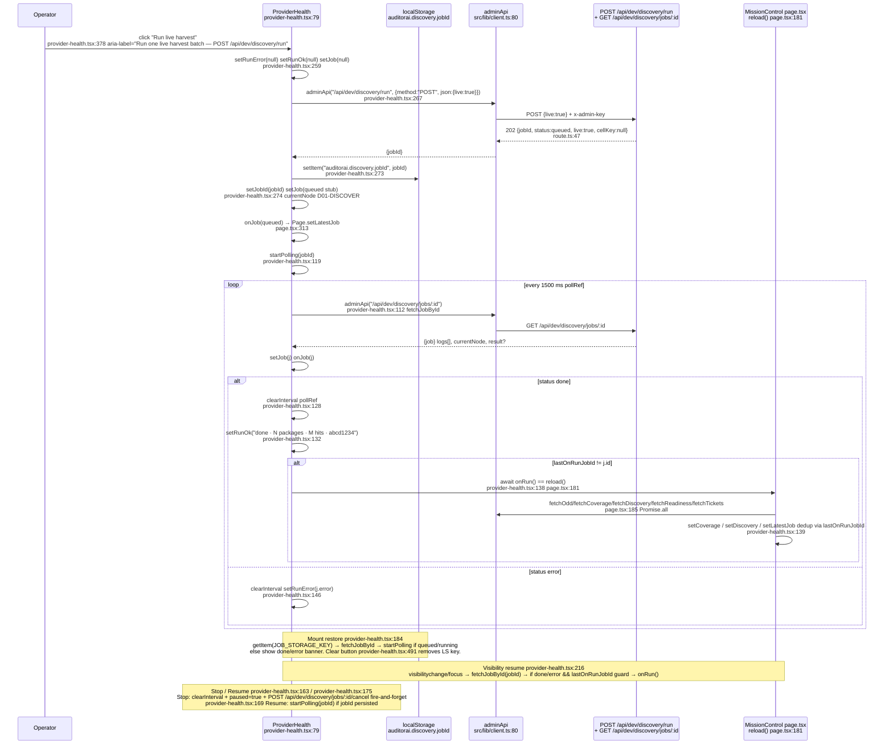

# Harvest UI Wiring — Two Buttons, One POST Seam (HV2)

**Ticket:** `HV2-ui-wiring` `workflow/wayfinder/maps/harvest-verification/tickets/HV2-ui-wiring.md:1`  
**Date:** 2026-09-08  
**Scope:** read-only — no ticket or `state/*.json` edits; this doc is write-only per task.  
**Verified against:** `src/app/dev/mission-control/_components/provider-health.tsx:1`, `src/app/dev/mission-control/_components/queue-ticker.tsx:1`, `src/app/dev/mission-control/page.tsx:1`, `src/lib/client.ts:1`, `src/lib/persistence/store.ts:1`.

## Question

> How are the two buttons *actually* wired today, and what state survives refresh/tab switch so an automated harness can drive them without a human?

Both buttons call the same `POST /api/dev/discovery/run {live:true[, cellKey]}` seam (via `src/lib/client.ts:80` `adminApi` → `x-admin-key`). They differ in payload, polling owner, localStorage survival, and error surface.

---

## 1. At a glance

| # | Button label | Owner component | Click handler | POST payload | `localStorage` | Poll owner | Done action | Error state |
|---|---|---|---|---|---|---|---:|---|
| **A** | **Run live harvest** | `src/app/dev/mission-control/_components/provider-health.tsx:378` `handleRun` `provider-health.tsx:258` | `provider-health.tsx:258` `async handleRun()` | `{live:true}` `provider-health.tsx:269` | `auditorai.discovery.jobId` `provider-health.tsx:57` (write `provider-health.tsx:273`, read `provider-health.tsx:185`) | `provider-health.tsx:119` `pollRef` interval `1500 ms` `provider-health.tsx:122`; restored on mount `provider-health.tsx:184` + `visibilitychange`/`focus` `provider-health.tsx:210` | `onRun` guarded by `lastOnRunJobId` → `page.tsx:181` `reload()` re-fetches odd/coverage/discovery/readiness/tickets; status `done` banner `provider-health.tsx:132` | `runError` `provider-health.tsx:83` |
| **B** | **Run this gap (Live)** | `src/app/dev/mission-control/_components/queue-ticker.tsx:158` `onRunCell` → `src/app/dev/mission-control/page.tsx:120` `handleRunGap` | `page.tsx:120` `async handleRunGap(cellKey)` via `queue-ticker.tsx:161` `onClick={() => onRunCell(key)}` | `{live:true, cellKey}` `page.tsx:125` e.g. `canada:PRELIMINARY_DESIGN` | **none** (volatile `gapRun` state `page.tsx:98` + `gapPollRef` `page.tsx:99`) | `page.tsx:135` `gapPollRef` `window.setInterval 1500 ms` `page.tsx:136`; cleared on unmount `page.tsx:168` | `setLatestJob(job)` each tick `page.tsx:144`, on `done` `setGapRun(null)` + `await reload()` `page.tsx:148`; `displayCoverage` swaps to live `page.tsx:211` | `gapRunError` `page.tsx:97` |

Both paths seed `latestJob` (`page.tsx:96`) so `HarvestLog` and `displayCoverage` reflect the live `job.result.coverage` even before `state/odd-coverage.json` is rewritten on disk.

Driving either button without `x-admin-key` (`src/lib/client.ts:80` `adminApi` → `x-admin-key: getAdminKey()` `client.ts:28`) yields `401` from `requireAdmin` before `harvest()` ever runs — the harness must seed `localStorage["auditorai.admin_key"]` first (see §3).

---

## 2. Sequence diagrams

### 2A. Button A — Run live harvest (ProviderHealth `handleRun`)



**Key wire details:**
- `handleRun` never short-circuits on `onRun` presence — it falls through to the jobs API (`provider-health.tsx:263`) and `onRun` is only called *after* poll sees `done` (`provider-health.tsx:138`), guarded by `lastOnRunJobId` (`provider-health.tsx:88` + `provider-health.tsx:139`).
- The persisted stub `queued` `DiscoveryJob` (`provider-health.tsx:275`) with `cellKey:null, live:true, currentNode:"D01-DISCOVER"` is what the panel renders until first poll tick.
- `Refresh` button (`provider-health.tsx:476`) intentionally *bypasses* the `lastOnRunJobId` dedup — `await fetchJobById(job.id)` then unconditional `await onRun()` — documented as "no scheduling side-effect" inspection.

### 2B. Button B — Run this gap (Live) (QueueTicker `onRunCell` → `page.tsx:handleRunGap`)

```mermaid
sequenceDiagram
    participant User as Operator
    participant QT as QueueTicker<br/>queue-ticker.tsx:49
    participant Page as MissionControl page.tsx<br/>handleRunGap page.tsx:120
    participant LS as localStorage
    participant API as adminApi<br/>src/lib/client.ts:80
    participant Route as POST /api/dev/discovery/run<br/>+ GET /api/dev/discovery/jobs/:id

    User->>QT: click "Run this gap (Live)"<br/>queue-ticker.tsx:161 data-testid="run-gap-{cellKey}" aria-label="Run gap {key} live"
    QT->>Page: onRunCell(cellKey) → handleRunGap(cellKey)<br/>page.tsx:120 queue-ticker.tsx:14
    Page->>Page: setGapRunError(null)<br/>page.tsx:121
    Page->>API: adminApi("/api/dev/discovery/run", {method:"POST", json:{live:true, cellKey}})<br/>page.tsx:123 runDiscovery equiv client.ts:107
    API->>Route: POST {live:true, cellKey} + x-admin-key
    Route-->>API: 202 {jobId, status}<br/>route.ts:47
    API-->>Page: {jobId, status}
    Page->>Page: setGapRun({id, status, cellKey})<br/>page.tsx:130
    Page->>Page: setLatestJob({id, status}) synthetic<br/>page.tsx:132 drives displayCoverage live
    Page->>Page: gapPollRef = setInterval 1500ms<br/>page.tsx:136 window.setInterval
    loop every 1500 ms gapPollRef
        Page->>API: adminApi("/api/dev/discovery/jobs/:id")<br/>page.tsx:138
        API->>Route: GET /api/dev/discovery/jobs/:id
        Route-->>Page: {job} with result {coverage, packages, hits, queue, matched, refusals, quality} when done
        Page->>Page: setGapRun({...status}) setLatestJob(job)<br/>page.tsx:142
        alt status done
            Page->>Page: clearInterval gapPollRef = null<br/>page.tsx:146
            Page->>Page: setGapRun(null)<br/>page.tsx:148 gap-detail collapses
            Page->>Page: await reload()<br/>page.tsx:149 re-fetches coverage file truth
        else status error
            Page->>Page: clearInterval setGapRun(null)<br/>page.tsx:151
            Page->>Page: setGapRunError(job.error)<br/>page.tsx:154
        end
    end
    alt fetch throws
        Page->>Page: clearInterval setGapRun(null) setGapRunError(e.message)<br/>page.tsx:157
    end
    Note over Page,LS: No localStorage for gap runs.<br/>Refresh drops gapPollRef + gapRun; ProviderHealth's JOB_STORAGE_KEY<br/>retains only button-A jobs. Gap progress survives only via<br/>GET /api/dev/discovery/jobs/:id by id captured in responses.
    Note over Page: Unmount cleanup page.tsx:168<br/>useEffect return clears gapPollRef to avoid leaked interval.
```

**Wiring glue in `page.tsx` (discovery segment) `page.tsx:311`:**
- `ProviderHealth onJob={(j) => setLatestJob(...)}` `page.tsx:313` and `QueueTicker onRunCell={handleRunGap} activeCellKey={gapRun?.cellKey}` `page.tsx:323` — both write the same `latestJob` lift (`page.tsx:96`) which feeds `displayCoverage` `page.tsx:211` and `HarvestLog job={latestJob}` `page.tsx:401`.
- `gapRun` non-null renders `div.gap-detail.open` (`page.tsx:329`, styled `src/app/globals.css:257`), with `--ox` origin from `lastPointerXRef` (`page.tsx:101` → `handleSelectKey` `page.tsx:110`) — cross-fade `transition 220ms cubic-bezier(0.32,0.72,0,1)` in `globals.css:257`.
- `QueueTicker` entrance stagger: `visible` state + `IntersectionObserver` + `120ms` timeout fallback (`queue-ticker.tsx:58`), per-card `transitionDelay ${i*90}ms` (`queue-ticker.tsx:112`), `prefers-reduced-motion` disables animation.

---

## 3. Selectors / test-ids & how to drive headless

### 3.1 Stable selectors (verified by `rg`)

| Target | Selector | File:line | Notes |
|---|---|---|---|
| **Run live harvest** button | `button[aria-label="Run one live harvest batch — POST /api/dev/discovery/run"]` containing text `Run live harvest` / `Running…` | `provider-health.tsx:381` | Disabled when `runLoading` (`provider-health.tsx:379`); shows `Running… {currentNode}` while `queued/running`. No `data-testid` — use `aria-label` or `getByRole('button', {name:/Run live harvest/})`. |
| **Doctor** button | `button[aria-label="Doctor — ping providers via GET /api/dev/health"]` | `provider-health.tsx:372` | Not a harvest button; useful as health-probe in harness. |
| **Stop** (pause polling) | `button[aria-label="Stop polling — job continues server-side"]` text `Stop` | `provider-health.tsx:399` | Visible only when `isRunning` (`provider-health.tsx:394`); fire-and-forget `POST /api/dev/discovery/jobs/:id/cancel` (`provider-health.tsx:169`). |
| **Resume** | `button[aria-label="Resume polling"]` text `Resume` | `provider-health.tsx:408` | Visible when `paused && job queued/running` (`provider-health.tsx:404`). |
| **Refresh** (bypasses dedup) | `button[aria-label="Refresh bypasses onRun dedup — deliberate manual inspection, no scheduling side-effect"]` text `Refresh` | `provider-health.tsx:485` | Calls `fetchJobById` + unconditional `onRun()` (`provider-health.tsx:478`). |
| **Clear** | text `Clear` (no aria-label) | `provider-health.tsx:489` | `localStorage.removeItem(JOB_STORAGE_KEY)` + `setJob(null)` (`provider-health.tsx:492`). |
| **Per-gap card** | `[data-testid="gap-card-{cellKey}"]` e.g. `gap-card-canada:PRELIMINARY_DESIGN` | `queue-ticker.tsx:114` | `aria-label="queue {rank} {key}"`. Also holds staggered transform. |
| **Gap details hotspot** (shows gap-detail) | `[data-testid="gap-details-{cellKey}"]` — inner div with `role="button" tabIndex=0` when `onSelectCell` | `queue-ticker.tsx:132` | Card click ≠ harvest — opens `gap-detail` panel (`page.tsx:349`) via `onSelectCell → handleSelectKey` (`page.tsx:322`). |
| **Run this gap (Live)** per card | `[data-testid="run-gap-{cellKey}"]` e.g. `run-gap-uk:FEASIBILITY_CONCEPT` | `queue-ticker.tsx:168` | `aria-label="Run gap {key} live"` (`queue-ticker.tsx:169`); disabled while `activeCellKey===key` (`queue-ticker.tsx:162`); z-index `z-10` + `pointer-events-auto` to not be swallowed by card click. |
| **Queue ticker container** | `[data-testid]` prefix `run-gap-`, `gap-card-`, `gap-details-` | — | `limit` default `3` (`queue-ticker.tsx:49`); `page.tsx:326` passes `limit={3}` so exactly `gaps_ranked.slice(0,3)` drive buttons. |
| **Gap detail panels** | `div.gap-detail.open` with CSS var `--ox` | `page.tsx:329` + `page.tsx:354` + `globals.css:257` | Two panels share class: gapRun panel (harvest progress) and selectedKey panel (coverage inspection). Distinguish by `Eyebrow code CH 0+421` for selectedKey vs `Triggered {cellKey}` for gapRun. |
| **Admin key input** | `input[placeholder="paste admin key"]` | `page.tsx:241` | Required to drive either button; gated error panel when `error ~ unauthorized`. |
| **Segment control** | `Segmented` options `Overview/Discovery/ODD Matrix/Readiness/Tickets/AI Harvest/Vault` | `page.tsx:37` | Harvest buttons live only under `discovery` segment (`page.tsx:311`). Harness must set segment to `discovery` first. |

### 3.2 Storage & transport keys

| Key | Type | Location | Purpose |
|---|---|---|---|
| `auditorai.discovery.jobId` | `localStorage` string `job_<base36>_<rand>` | `provider-health.tsx:57` `JOB_STORAGE_KEY` | **Only button A persists.** Survives refresh/tab switch; restored at `provider-health.tsx:185`. Button B has no equivalent — `gapRun` is memory-only (`page.tsx:98`). |
| `auditorai.admin_key` | `localStorage` string | `src/lib/client.ts:11` `ADMIN_KEY_ITEM` via `getAdminKey()` `client.ts:28` | Sent as `x-admin-key` by `adminApi` (`client.ts:80`). Without it both buttons 401. |
| `auditorai.workspace_key` | `localStorage` | `client.ts:10` `KEY_ITEM` | Used by `api()` (`client.ts:76`), **not** by harvest — `adminApi` ignores it. |
| `currentNode` / `logs[]` / `result` | in-memory job fields | `provider-health.tsx:35` `DiscoveryJob` | Poll `GET /api/dev/discovery/jobs/:id` is canonical; UI log tail shows last 6 (`provider-health.tsx:445`). |
| `latestJob` / `displayCoverage` / `isLiveCoverage` | page lifted state | `page.tsx:96` + `page.tsx:211` | `displayCoverage = latestJob?.result?.coverage ?? coverage` — live overlay until `state/odd-coverage.json` persists. `isLiveCoverage` badges in `kpi-strip.tsx:107` / `discovery-status.tsx:24`. |

### 3.3 Headless harness recipes

**Prefer API over click when possible** — `adminApi` is the wire. Direct POST is deterministic; click automation needs segment switching + visibility.

*API-level (recommended for auto-monitor):*
```ts
import { adminApi } from "@/lib/client";
localStorage.setItem("auditorai.admin_key", "test-admin-key-0123456789abcdef");
// gap-aware
const { jobId } = await adminApi<{jobId:string}>("/api/dev/discovery/run", {method:"POST", json:{live:true}});
// gap-targeted
const { jobId } = await adminApi<{jobId:string}>("/api/dev/discovery/run", {method:"POST", json:{live:true, cellKey:"canada:PRELIMINARY_DESIGN"}});
// poll
let j; do { await new Promise(r=>setTimeout(r,1500)); j = await adminApi<{job:any}>(`/api/dev/discovery/jobs/${jobId}`); } while (j.job.status==="queued"||j.job.status==="running");
```

*Click-level (E2E / Playwright):*
```ts
// 1. seed admin key + reload (or setAdminKey via page.evaluate)
await page.evaluate(k => localStorage.setItem("auditorai.admin_key", k), "test-admin-key-0123456789abcdef");
await page.reload();
// 2. navigate to discovery segment
await page.getByRole("button", {name:"Discovery"}).click();
// 3A. Run live harvest
await page.getByRole("button", {name:/Run live harvest/}).click();
await expect(page.getByText(/polling 1\.5s/)).toBeVisible();
// 3B. Run this gap — pick first gap
await page.locator('[data-testid^="run-gap-"]').first().click();
// assert disabled Running…
await expect(page.locator('[data-testid^="run-gap-"]').first()).toBeDisabled();
// gap-detail anchor visible with --ox
await expect(page.locator('.gap-detail.open')).toBeVisible();
// 4. drive gap-detail inspection without harvesting
await page.locator('[data-testid^="gap-details-"]').first().click();
await expect(page.getByText(/Gap detail/)).toBeVisible();
```

**Prefix discovery:** don't hardcode `canada:PRELIMINARY_DESIGN` — enumerate `[data-testid^="run-gap-"]` by stripping prefix `run-gap-`. Keys are `jurisdiction_id:canonical_stage(s)` in lowercase jur (validated against `policies/odd.json`).

---

## 4. What survives refresh / tab switch

| Mechanism | Owner | Lifetime | What it replays | Gap for harness |
|---|---|---|---|---|
| `JOB_STORAGE_KEY` `auditorai.discovery.jobId` | `provider-health.tsx:184` `useEffect` on mount | `localStorage` until `Clear` or `removeItem` on unknown job `provider-health.tsx:191` | Re-hydrates `jobId` + `fetchJobById` + `startPolling` if `queued/running`; shows `done·Npkgs` banner if `done` | Only covers button A. Button B state is lost on refresh. |
| `gapPollRef` interval | `page.tsx:136` `window.setInterval` | JS heap — killed on refresh/unmount `page.tsx:168` | None after refresh — next poll never fires; `gapRunError` cleared | Harness polling must be out-of-page (API loop) or re-issue run. |
| `visibilitychange` / `focus` | `provider-health.tsx:210` | Document lifetime | Re-fetches `jobId` job and conditionally `onRun()` when `done/error` (`provider-health.tsx:225`) with `lastOnRunJobId` dedup | Protects against missed `done` while tab backgrounded; but dedup means second visibility won't double `reload()`. |
| `lastOnRunJobId` guard | `provider-health.tsx:88` | Ref lifetime — reset on `jobId` change `provider-health.tsx:212` | Prevents duplicate `onRun()` across poll + visibility (`provider-health.tsx:139` + `provider-health.tsx:226`) | Auto-monitor must not count `reload()` fires — count `ledgerTotal` or job `status`, not reload callbacks. |
| `lastPointerXRef` | `page.tsx:101` | Heap, updated on `pointerdown` `page.tsx:103` | `handleSelectKey` derives `gapOrigin` `%` (`page.tsx:114`) for `gap-detail` `transform-origin --ox` | Visual only; not relevant to correctness. |
| `displayCoverage` overlay | `page.tsx:211` `latestJob?.result?.coverage ?? coverage` | Heap until `reload()` overwrites `coverage` | Immediately shows live coverage before file persists; `HarvestLog` synthetic merge `harvest-log.tsx:78` does same for empty ledger | File `state/odd-coverage.json` lags; see §5 double-count trap. |

**Implication:** an unattended harness that refreshes or switches tabs can recover button-A jobs via the surviving `JOB_STORAGE_KEY` but **cannot** recover button-B jobs. For automation, capture the `jobId` returned by `POST /api/dev/discovery/run` synchronously and poll `GET /api/dev/discovery/jobs/:id` directly rather than relying on UI recovery.

---

## 5. What the auto-monitor must not double-count

This is the "live vs truth" trap. Three layers look like they should agree but diverge by design.

### 5.1 Dedupe vs ledger vs live coverage — the three counters

| Counter | Where harness might read it | What it actually counts | When it advances |
|---|---|---|---|
| **`dedupe.sha256Entries` / `dedupe.clusters`** (`GET /api/dev/discovery` `discovery/route.ts:48` → KV `discovery:dedupe-index` falling back to `state/dedupe-index.json`, rendered `discovery-status.tsx:14`) | `discoveryStatus dedupe.sha256Entries`, or `state/dedupe-index.json:1` directly | Unique fingerprints claimed by `persistDedupeFromResult` (`dedupe-persist.ts:79` → `claimFingerprints` `dedupe.ts:65`) only for packages where `quality.dedupe_status==="unique"` | Only when D08 produced *new* unique packages; duplicates / near_dups produce **no** advance. A success with 5 duplicate packages looks like "no progress" if you count dedupe, but ledger still advanced. |
| **`ledgerTotal` / `ledgerTail[]`** (`GET /api/dev/discovery` `ledgerTotal/lastAt/ledgerTail` `discovery/route.ts:18` → KV `discovery:ledger:index` + entries `ledger.ts:6` fallback file `state/discovery-ledger.json`) | `DiscoveryStatus ledgerTotal` `discovery-status.tsx:13` / `HarvestLog` groups `harvest-log.tsx:70` | Per-slice ledger entries (up to 10 per run: `discovery_hits`, `qualified`, `matched`, `acquired`, `classified`, `package`, `provenance`, `quality`, `coverage`, `queue` in `harvest.ts:329`) | Once per passing D-stage in `executeJob` → `persistDiscoveryState` `harvest.ts:295` regardless of dedupe. This is the **throughput** signal, not uniqueness. |
| **`coverage` / `queue` (file vs live)** (`GET /api/dev/coverage` or `GET /api/dev/discovery/jobs/:id` `result.coverage` vs `state/odd-coverage.json` file) | `KpiStrip coverage.cells have_total` `kpi-strip.tsx:79`, `QueueTicker gaps_ranked` `queue-ticker.tsx:50`, `HarvestLog` synthetic merge `harvest-log.tsx:81` | Cells' `have_total`/`have_full_package` counts from `pipeline.ts:306` `computeCoverage`; queue from `buildQueue` | `job.result.coverage` is **immediate** (in-memory); `state/odd-coverage.json` persists best-effort (`harvest.ts:361` swallowed on EROFS). They diverge on Vercel or when file write races. |

### 5.2 The exact double-count bugs to avoid

1. **Do NOT sum `dedupe.sha256Entries` + `ledgerTotal`.** They are not additive — dedupe is a subset property of ledger's `package`/`quality` slices. A run that claims 2 sha entries while ledger grows by 8 entries (e.g. 8 slices) is one run, not `2+8`.

2. **Do NOT count `job.result.coverage` AND `state/odd-coverage.json` both as new-coverage events.** `page.tsx:211` overlays `latestJob.result.coverage` as `displayCoverage` even before `state/odd-coverage.json` is written. The file catches up on `reload()` (`page.tsx:149` for gap, `provider-health.tsx:138` for live harvest). Counting both inflates by 1 per run. Pick one source per assertion: **live** = `job.result.coverage` (`GET /api/dev/discovery/jobs/:id`) for latency, **truth** = `state/odd-coverage.json` / `GET /api/dev/coverage` for persistence proof — not both.

3. **Do NOT count `HarvestLog` synthetic entries as real ledger writes.** When `ledgerTail` is empty but `job.status==="done"` with packages, `harvest-log.tsx:81` injects a synthetic `package.assemblies` + `quality.verdicts` group at `maxSeq+1/2`. This is a UI merge for "file lag", not in `discovery:ledger:index`. The `ledgerTotal` from `GET /api/dev/discovery` excludes synthetics.

4. **Do NOT treat `gaps_ranked` re-order vs `queue` change as two gaps-fixed signals.** `OddMatrix gaps_ranked` side-list (`odd-matrix.tsx:62`) and `QueueTicker coverage.gaps_ranked.slice(0,3)` (`queue-ticker.tsx:50`) and `job.result.queue` are three views of the same `buildQueue` ranking. Observe `after - before` on exactly one view.

5. **KV-first vs file divergence is expected, not a bug to count twice.** `GET /api/dev/discovery` uses KV `ledgerTail(20)` when `ledgerTotal>0` (`discovery/route.ts:18`) but `GET /api/dev/health` reads file `state/discovery-ledger.json` for `ledgerAge` (`health/route.ts:62`) and harvest health does KV-first for dedupe but file for ledger. Comparing across endpoints without noting the seam over-counts staleness. Trust KV totals (`ledgerTotal`) as canonical when `KV_REST_API_URL` is set; file is mirror (`store.ts:162` fallback).

### 5.3 Recommended harness assertions (single-count)

```
before = { ledgerTotal, dedupeSha, coverageHaveTotal, gapsRanked }
POST /api/dev/discovery/run {live:true[, cellKey]} → {jobId}
poll GET /api/dev/discovery/jobs/:id until done

// exactly one increment per run for each signal — choose the right seam
assert newJob.status === "done"                        // not error / lock busy
assert GET /api/dev/discovery ledgerTotal == before.ledgerTotal + k   // k ∈ [1,10], non-empty slices only
assert ledger.lastAt === newJob.result.ranAtIso        // coherence, not a second count
// dedupe is allowed to stay flat — do not require increase:
assert GET /api/dev/discovery dedupe.sha256Entries >= before.dedupeSha  // >= not >
// coverage: pick ONE truth per check
assert newJob.result.coverage.generated === ranAtIso    // live truth
// after reload(), file truth must converge — but don't count both live+file as 2:
assert (await fetchCoverage()).generated === ranAtIso  // file truth, after reload()
```

Poll cadence: match UI `1500 ms` (`provider-health.tsx:122`, `page.tsx:136`). Budget ~60 s (`POST route maxDuration=60` in `run/route.ts:9`).

---

## 6. How errors surface differently

| Failure | Button A display | Button B display | Job `status` | How to detect in harness |
|---|---|---|---|---|
| `UnknownCellKeyError` (unknown `cellKey`) | n/a (never sends `cellKey`) | `gapRunError` `page.tsx:154` or `gapRunError` from catch `page.tsx:164`; no `gapRun` | No job created — POST returns `400` | `adminApi` throws `error:"unknown cellKey"` |
| Process-local lock busy | `runError` via next poll `error:"harvest is already running"` `harvest.ts:140` | `gapRunError` with same message (job returned) — POST still 202 | `status:error error:"harvest is already running"` | Poll reveals error within 1 tick. 202 was "silent". |
| KV distributed lock busy | `runError` via `error:"harvest lock held (kv)"` `harvest-lock.ts:10` | `gapRunError` with `harvest lock held (kv)` | `status:error` | Same as above; KV TTL 120 s. |
| Cancel | `Stop` clears `pollRef` + `paused` banner (`provider-health.tsx:166`); server `updateJob cancelled` (`cancel/route.ts:6`) | Not exposed (no cancel UI on gap runs) | `status:cancelled` `+ D00-CANCELLED` log | `executeJob` checks `getJob` before each node `harvest.ts:192`. |
| File EROFS / `persistDiscoveryState` throw | Swallowed, `PERSIST-WARN` log `harvest.ts:234`; job still `done` but KV may diverge | Same; `HarvestLog` synthetic merge masks file lag | `status:done` despite missing file write | `GET /api/dev/discovery` KV tail will differ from file. |

---

## 7. Appendix — files read, no edits

```
src/app/dev/mission-control/_components/provider-health.tsx:1   handleRun → adminApi POST {live:true} → JOB_STORAGE_KEY → 1.5s poll → onRun reload
src/app/dev/mission-control/_components/queue-ticker.tsx:1      onRunCell → data-testid run-gap-{key}, gap-card-{key}, gap-details-{key}
src/app/dev/mission-control/page.tsx:1                          handleRunGap → adminApi POST {live:true, cellKey} → gapPollRef 1.5s → displayCoverage live overlay
src/lib/client.ts:1                                              adminApi (x-admin-key), runDiscovery/fetchCoverage/fetchJob aliases
src/lib/persistence/store.ts:1                                   DataStore seam — MemoryStore vs KvRestStore fallback behavior
src/app/dev/mission-control/_components/harvest-log.tsx:1        synthetic live merge — must not double-count
src/app/dev/mission-control/_components/kpi-strip.tsx:1          isLive badge when displayCoverage is live
src/app/dev/mission-control/_components/discovery-status.tsx:1   dedupe vs ledger rendering split
src/app/globals.css:257                                          gap-detail cross-fade + segment-panel + reduced-motion
docs/research/harvest-backend-seams.md:1                         backend seam doc — complementary to this UI doc
```

*Generated for HV2 — satisfies `docs/research/harvest-ui-wiring.md` with sequence diagrams + selector inventory + refresh-survival + dedup double-count guidance; verified via file reads without ticket/state writes.*
